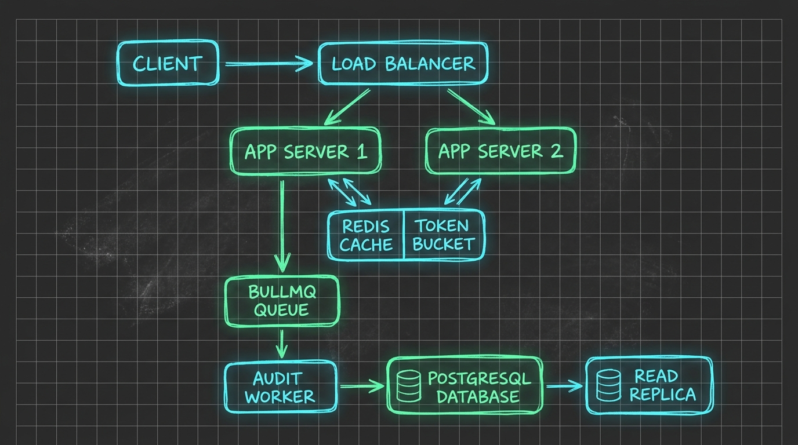
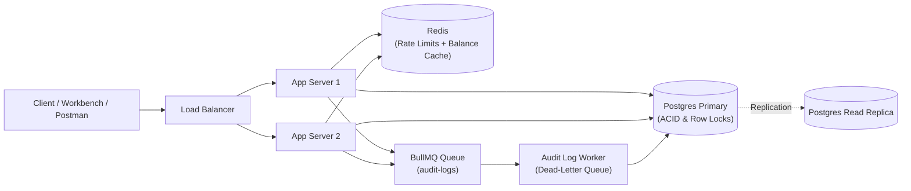

# ledger-api

[](https://github.com/Anshulkaocde123/ledger-api/actions/workflows/ci.yml)

A resilient, audit-compliant banking-style ledger and payments backend built with Node.js, Express, and PostgreSQL.

---

## Overview

`ledger-api` provides core accounting, transaction processing, and ledger capabilities modeled after financial-grade double-entry bookkeeping systems. It guarantees data consistency, immutability of audit trails, and strict separation of concerns across layered application boundaries.

Key capabilities planned:
- Double-entry ledger architecture (debits and credits balance to zero)
- Atomic transaction execution with isolation against race conditions
- Account management with multi-currency support
- Idempotent payment processing via Redis caching / lock management
- Secure JWT-based authentication and role-based authorization

---

## Architecture

### System Topology



<details>
<summary>Click to view Mermaid Topology Specification</summary>


</details>

### Layered Architecture (Separation of Concerns)

```
[ HTTP Client / External Services ]
                 │
                 ▼
        [ Routes / Middlewares ]
  (Authentication, Rate Limiting, Request Validation)
                 │
                 ▼
          [ Controllers ]
  (HTTP parsing, status codes, payload formatting)
                 │
                 ▼
           [ Services ]
  (Business logic, ledger integrity, domain rules, transaction boundaries)
                 │
                 ▼
         [ Repositories ]
  (Database access, SQL queries, transactional pooling)
                 │
                 ▼
      [ PostgreSQL / Redis ]
```

### Folder Breakdown

- `src/controllers/`: Handle HTTP request parsing, input sanitization, and response code mapping.
- `src/services/`: Contain core business logic, orchestrate transactional boundaries, and enforce domain constraints.
- `src/repositories/`: Abstract raw SQL queries, data mapping, and PostgreSQL interaction.
- `src/middleware/`: Express middlewares for JWT auth, global error catching, and validation.
- `src/models/`: Domain schemas, DTOs, and entity definitions.
- `src/utils/`: Common utilities such as standard error classes, mathematical helpers, and loggers.
- `src/config/`: Database pools, Redis connections, and environment variable loaders.

---

## Setup

### Prerequisites
- **Node.js**: v18+ or v20+
- **PostgreSQL**: v14+
- **Redis**: v6+

### Installation

1. Clone the repository and navigate to the project directory:
   ```bash
   git clone <repo-url>
   cd ledger-api
   ```

2. Install dependencies:
   ```bash
   npm install
   ```

3. Configure environment variables:
   ```bash
   cp .env.example .env
   # Edit .env with your local PostgreSQL and Redis credentials
   ```

4. Start the application:
   - **Development (with hot reload)**:
     ```bash
     npm run dev
     ```
   - **Production**:
     ```bash
     npm start
     ```
   - **Run tests**:
     ```bash
     npm test
     ```

5. Run with Docker Compose (Local Stack):
   ```bash
   # Boots PostgreSQL, Redis, runs DB migrations, and starts the API + BullMQ worker
   docker compose up --build
   ```

6. Interactive Testing Tools (Web & Terminal UI):
   - **Web Workbench & Inspector (Burp / DevTools Style UI)**:
     Open your browser to `http://localhost:3000/` (or your deployed cloud URL). Includes:
     - ⚡ **1-Click Simulation**: Automates signup, login, double-entry funding, transfer, and idempotency replay.
     - 📡 **Burp-Style Request/Response Inspector**: Custom methods, paths, headers, JSON editor, status badges, latency timers, and header inspection.
     - 🔍 **Financial Internals Callouts**: Real-time visual badges for `X-Cache-Lookup: HIT/MISS`, `Idempotent-Replay: true`, and `Retry-After: <seconds>`.
   - **Interactive Terminal Studio (CLI)**:
     Run directly from your terminal:
     ```bash
     npm run cli
     # Or against a deployed remote URL:
     API_URL=https://ledger-api-xxxx.onrender.com npm run cli
     ```

---

## Deployment

### Deploy to Render (Infrastructure as Code)

This repository includes a turnkey [render.yaml](render.yaml) Blueprint that provisions a complete production stack on Render with a single click.

[](https://render.com/deploy)

#### Resources Provisioned by `render.yaml`:
1. **Managed PostgreSQL 16 (`ledger-postgres`)**: Persistent database instance.
2. **Managed Redis (`ledger-redis`)**: High-performance in-memory cache, rate limiter, and BullMQ queue broker with `noeviction` policy.
3. **Web API Service (`ledger-api`)**: Multi-stage Dockerized Express application. Automatically runs `node src/database/migrate.js` during the `preDeployCommand` phase before routing live traffic.
4. **Audit Worker (`ledger-audit-worker`)**: Background worker executing `node src/worker.js` to process asynchronous audit logs from BullMQ with exponential backoff and dead-letter queues.

#### Step-by-Step Deployment Guide:
1. **Fork or Push** this repository to your GitHub account.
2. Navigate to the [Render Dashboard](https://dashboard.render.com/) and click **New +** $\rightarrow$ **Blueprint**.
3. Connect your forked repository. Render will automatically detect and parse `render.yaml`.
4. Render automatically configures:
   - Dynamic internal connection strings for `DATABASE_URL` and `REDIS_URL`.
   - Cryptographically random 256-bit secrets for `JWT_SECRET` and `JWT_REFRESH_SECRET`.
5. Click **Apply**. Render builds the Docker image, applies SQL migrations, and brings all services online.

---

## API Endpoints

> *Note: Endpoints will be implemented and populated incrementally.*

### Authentication & Users
| Method | Endpoint | Description | Auth Required |
| :--- | :--- | :--- | :--- |
| `POST` | `/api/v1/auth/register` | Register a new user | No |
| `POST` | `/api/v1/auth/login` | Authenticate and retrieve JWT tokens | No |
| `POST` | `/api/v1/auth/refresh` | Refresh access token | No |

### Accounts
| Method | Endpoint | Description | Auth Required |
| :--- | :--- | :--- | :--- |
| `POST` | `/api/v1/accounts` | Create an account (asset, liability, equity, etc.) | Yes |
| `GET` | `/api/v1/accounts/:id` | Get account details & balance snapshot | Yes |
| `GET` | `/api/v1/accounts/:id/entries` | Get ledger entries for an account | Yes |

### Transactions & Payments
| Method | Endpoint | Description | Auth Required |
| :--- | :--- | :--- | :--- |
| `POST` | `/api/v1/transactions` | Post balanced multi-entry transaction | Yes |
| `POST` | `/api/v1/payments/transfer` | Execute funds transfer between accounts | Yes |
| `GET` | `/api/v1/transactions/:id` | Retrieve transaction details & audit trail | Yes |

---

## Design Decisions & ADRs

The architectural choices in this project are documented in formal Architecture Decision Records:

- **[ADR 0001: Derived Balance via Double-Entry vs. Stored Column](docs/adr/0001-derived-balance-double-entry.md)**: Why balance is computed as `SUM(credits) - SUM(debits)` rather than a mutable integer column.
- **[ADR 0002: Row-Level Locking vs. SERIALIZABLE Isolation](docs/adr/0002-row-level-locking-vs-serializable.md)**: Why deterministic `SELECT ... FOR UPDATE` was chosen over optimistic serialization retries.
- **[ADR 0003: BullMQ (Redis-Backed) vs. Apache Kafka](docs/adr/0003-bullmq-vs-kafka.md)**: Operational simplicity, dead-letter routing, and resource trade-offs at this scale.
- **[ADR 0004: JWT + Refresh Token Rotation vs. Server-Side Sessions](docs/adr/0004-jwt-refresh-rotation-vs-server-sessions.md)**: Stateless horizontal scaling with automated reuse detection and token revoking.

---

## What I'd Do Differently at Scale (>100,000 TPS)

1. **Periodic Balance Snapshotting (Checkpoints)**:
   - *Current*: Balances are dynamically calculated from all historical `ledger_entries` (backed by Redis cache).
   - *At Scale*: A nightly or hourly checkpoint worker calculates and seals account snapshots. Balance queries become `last_snapshot_balance + SUM(entries since snapshot)`, bounding read latency to $O(1)$ regardless of account age.
2. **Kafka Event Streaming for Audit & Analytics**:
   - *Current*: BullMQ handles asynchronous audit log insertion into PostgreSQL.
   - *At Scale*: Replace BullMQ with Apache Kafka to support multi-consumer fanout (compliance, fraud detection, analytics data lakes) with multi-partition horizontal scaling and long-term event retention.
3. **Read Replicas & CQRS**:
   - *Current*: Single primary PostgreSQL instance handles both writes and statement queries.
   - *At Scale*: Route heavy read-only traffic (balance snapshots, statement history, ledger audit lookups) to PostgreSQL Read Replicas, reserving the primary strictly for transactional row-locked transfers.
4. **Distributed Tracing & Metrics**:
   - *Current*: Centralized structured JSON logging and console metrics.
   - *At Scale*: Integrate OpenTelemetry with Prometheus and Jaeger/Datadog to trace transfer latencies across gateway, Redis lock acquisition, and database transactions.

